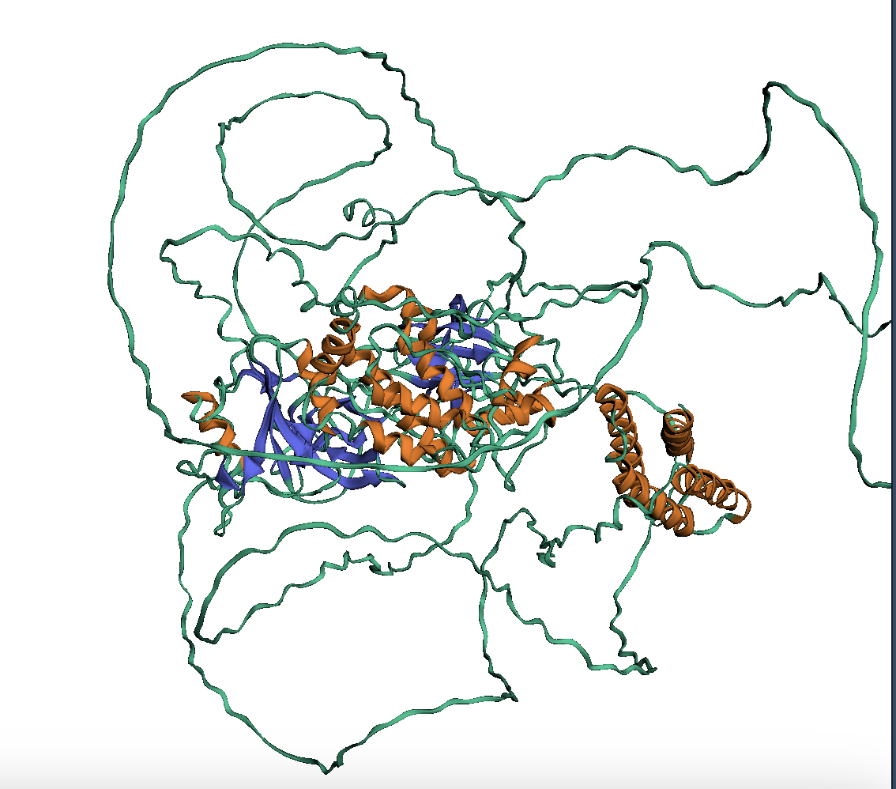
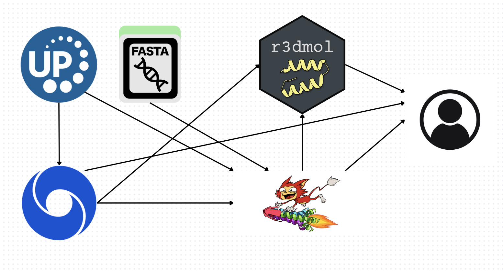

<!-- README.md is generated from README.Rmd. Please edit that file -->

# foldSeekR

<!-- badges: start -->
<!-- badges: end -->

## Description

`foldSeekR` is an R package designed to streamline protein structure
predictions via AlphaFold (<https://alphafold.ebi.ac.uk/>) and
architecture comparisons via FoldSeek (<https://www.foldseek.com>).
foldSeekR uses Uniprot accession ID’s or FASTA files or strings to
search structure similarities on AlphaFold. It uses FoldSeek to query
the AlphaFold database for the most similar protein architectures to the
protein structure of interest. It provides visualization of the protein
of interest and the similar proteins with highlighted regions similar to
the target protein. `foldSeekR` was developed using
`R version 4.4.1 (2024-06-14)`, `Platform: aarch64-apple-darwin20` and
`Running under: macOS Sonoma 14.6.1`.

## Installation

To install the latest version of the package:

``` r
require("devtools")
devtools::install_github("bellabr/foldSeekR", build_vignettes = TRUE)
library("foldSeekR")
```

To run the shinyApp: Under construction

## Overview

``` r
ls("package:foldSeekR")
browseVignettes("foldSeekR")
```

`foldSeekR` contains 3 functions in the current version.

***pull_prediction*** for pulling protein architecture prediction
information from AlphaFold including sequential information and links to
downloadable data files (PDB, CIF, or mmCIF).

***pull_summary*** for pulling protein summary information from
AlphaFold including Uniprot information and structural information.

***visualize_prediction*** for producing an interactive and colourful
visualization of the protein of interest.

The 2 functions currently under construction and being developed for the
upcoming version are as follows.

***foldseek*** for querying the protein of interest or sequence of
interest (FASTA) via FoldSeek to find the most structurally similar
protein architectures available in the 8 databases supported by
FoldSeek.

***visualize_foldseek*** for producing an interactive and colourful
visualization of the protein of interest compared to the most similar
proteins of interest found by `foldseek`. The visualizations are
side-by-side and interact together, in addition to being colour-coded by
each region of similarity to the target protein of interest.

Refer to package vignettes for more details. A snapshot of the protein
visualization is illustrated below.



An image of the workflow of foldSeekR is illustrated below.



## Contributions

The author of the package is Annabella Bregazzi.

The author wrote the pull_prediction function, which makes use of httr2.

The author wrote the pull_summary function, which makes use of httr2.

The author wrote the visualize_prediction function, which makes use of
BiocFileCache, r3dmol, and bio3d.

No generative AI tools were used in the development of this package.

## References

- Jumper, J. et al. “Highly accurate protein structure prediction with
  AlphaFold.” *Nature*, 596, pages 583–589 (2021). DOI:
  10.1038/s41586-021-03819-2

- Varadi, M. et al. “AlphaFold Protein Structure Database in 2024:
  Providing structure coverage for over 214 million protein sequences.”
  *Nucleic Acids Research*, gkad1011 (2023). DOI: 10.1093/nar/gkad1011

- Varadi, M. et al. “AlphaFold Protein Structure Database: massively
  expanding the structural coverage of protein-sequence space with
  high-accuracy models.” *Nucleic Acids Research*, 50(D1), pages
  D439–D444 (2021). DOI: 10.1093/nar/gkab1061

- Barrio-Hernandez, I., Yeo, J., Jänes, J., Mirdita, M., Gilchrist,
  C.L.M., Wein, T., Varadi, M., Velanka, S., Beltrao, P., and
  Steinegger, M (2023). Clustering predicted structures at the scale of
  the known protein universe. *Nature* 622: 637-645.
  <https://doi.org/10.1038/s41586-023-06510-w>.

- van Kempen, M., Kim, S.S., Tumescheit, C., Mirdita, M., Lee, J.,
  Gilchrist, C.L.M., Söding, J., and Steinegger, M (2024). Fast and
  accurate protein structure search with Foldseek. *Nature
  Biotechnology* 42: 243-246.
  <https://doi.org/10.1038/s41587-023-01773-0>.

- Kim, W., Mirdita, M., Karin, E.L., Gilchrist, C., Schweke, H., Söding,
  J., Levy, E., and Steinegger, M. (2024). Rapid and Sensitive Protein
  Complex Alignment with Foldseek-Multimer. *bioRxiv* 2024.04.14.589414.
  <https://www.biorxiv.org/content/10.1101/2024.04.14.589414v1>.

- Grant B, Rodrigues A, ElSawy K, McCammon J, Caves L (2006). “Bio3D: An
  R package for the comparative analysis of protein structures.”
  Bioinformatics, 22, 2695–2696.

- Su W, Johnston B (2023). r3dmol: Create Interactive 3D Visualizations
  of Molecular Data. R package version 0.2.0,
  <https://github.com/swsoyee/r3dmol>.

- Wickham H (2024). httr2: Perform HTTP Requests and Process the
  Responses. R package version 1.0.6.9000, ,
  <https://github.com/r-lib/httr2>.

- Shepherd L, Morgan M (2024). BiocFileCache: Manage Files Across
  Sessions. R package version 2.14.0.

## Acknowledgments

This package was developed as part of an assessment for 2024 BCB410H:
Applied Bioinformatics course at the University of Toronto, Toronto,
CANADA. `foldSeekR` welcomes issues, enhancement requests, and other
contributions. To submit an issue, use the GitHub issues.
